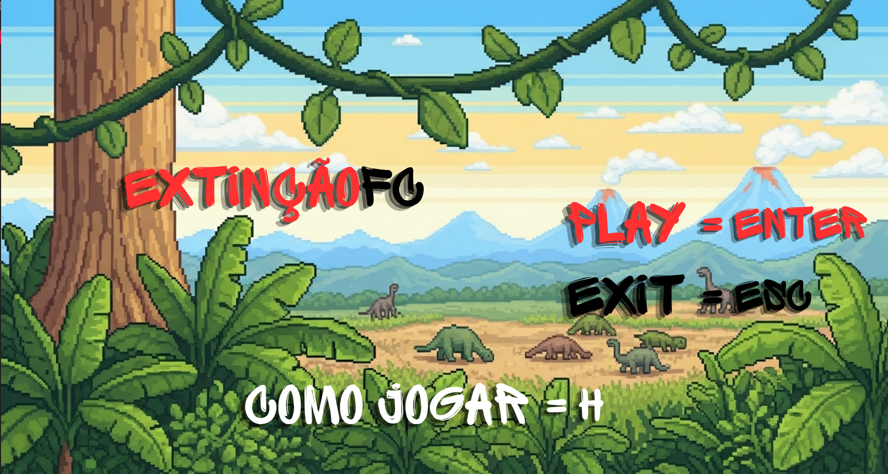
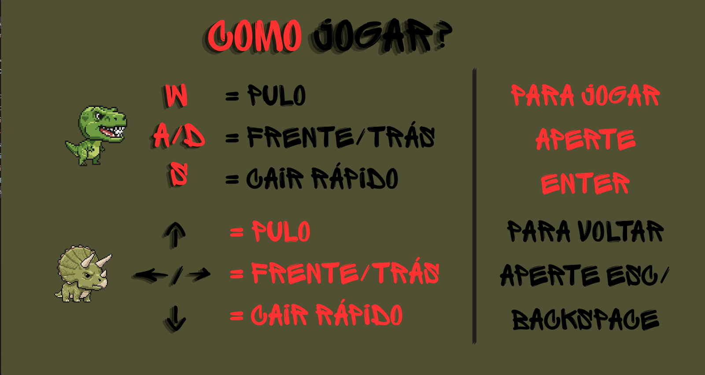
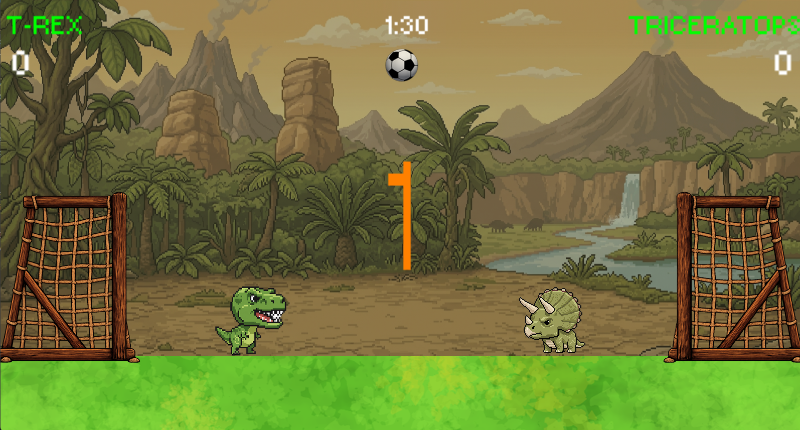
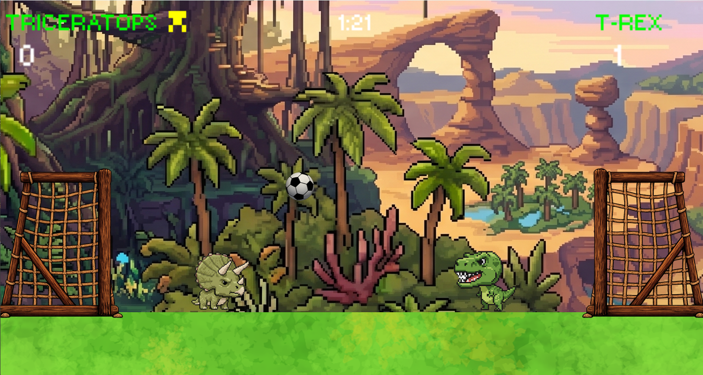
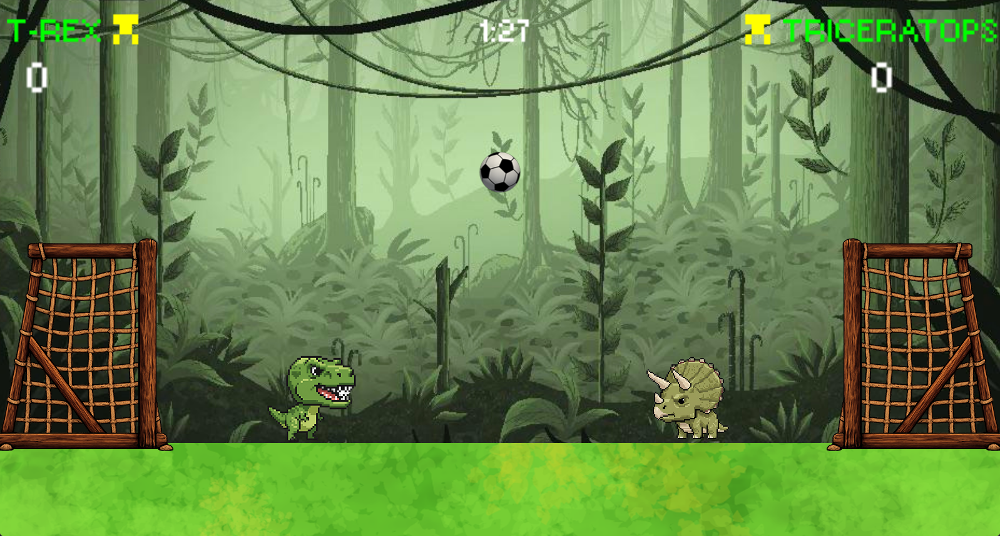
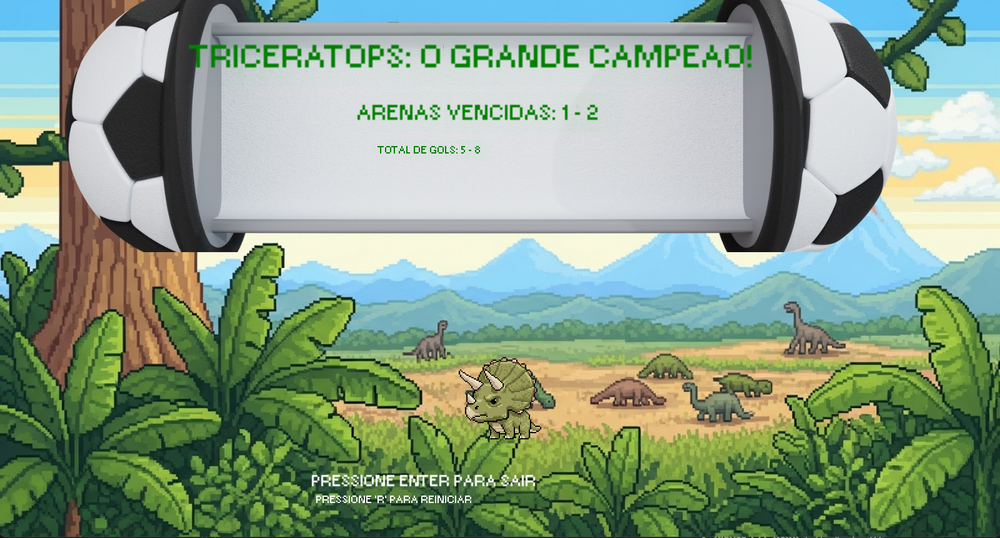

# Extinção FC 🦖⚽🦕

**Extinção FC** é um jogo de futebol 2Donde dinossauros disputam partidas de futebol no estilo *Soccer head*! Desenvolvido em C++ utilizando uma Engine 2D proprietária, o projeto foi criado como trabalho acadêmico para a disciplina de Programação de Jogos.

---

## 📸 Imagens do Jogo

### Tela Inicial

*Pressione ENTER para jogar ou H para abrir a tela de ajuda*

### Tela de ajuda

### Gameplay
- **Mapa 1**

- **Mapa 2**

- **Mapa 3**

*T-Rex vs Triceratops! Física customizada, colisão precisa e placar dinâmico.*

### Game Over / Vitória

*A comemoração após atingir o limite de gols ou o fim do tempo!*

---

## 🎮 Como Jogar

O objetivo é simples: marque **3 gols** antes do seu adversário ou termine a partida de **1 minuto** com o maior placar!

**Controles Básicos:**
*   **Player 1 (T-Rex):** `[ W, A, S, D]`
*   **Player 2 (Triceratops):** `[Setas]`
*   **H:** Exibir a tela de Ajuda (a partir do Menu)
*   **B:** Ligar/Desligar a visualização dos *Bounding Boxes* (Modo Debug)
*   **ESC:** Sair do jogo / Voltar para o Menu

---

## ⚙️ Funcionalidades e Mecânicas Implementadas

O jogo conta com diversos sistemas de *Game Design* e física criados do zero:

*   **Física da Bola:** Implementação de gravidade contínua, taxa de restituição (quiques nas paredes e no chão) e transferência de força e inércia no impacto com os jogadores.
*   **Regras de Partida Reais:** 
    *   **Goal Line Technology:** O gol só é validado quando a bola cruza *completamente* a linha central do sensor do gol.
    *   **Kickoff System:** Após um gol, o campo é limpo, há um delay de 3 segundos de tensão (jogadores travados) antes da bola cair na direção do jogador que sofreu o gol.
    *   **Condições de Fim de Jogo:** Vitória ao atingir 5 gols ou fim do tempo de 60 segundos com suporte a empate.
*   **Clean Code & State Management:** Separação clara de responsabilidades na classe principal (`ExtincaoFC`), lidando com os estados de "Bola Rolando", "Kickoff", "Comemoração de Gol" e "Game Over".
*   **Áudio Contínuo:** Sistema de renderização unificada na `Home` que permite abrir a tela de `Help` sem interromper a música de abertura.

---

## 🛠️ Tecnologias Utilizadas

*   **Linguagem:** C++
*   **Engine:** Engine 2D proprietária (baseada em DirectX/Win32)
*   **IDE:** Visual Studio 2026

---

## 🚀 Como Compilar e Rodar

1. Clone este repositório em sua máquina.
2. Abra o arquivo da solução `ExtincaoFC.sln` no **Visual Studio**.
3. Certifique-se de que a plataforma alvo está configurada corretamente (ex: `x64` ou `x86`, `Debug` ou `Release`).
4. Construa a solução (`Ctrl + Shift + B`).
5. Pressione `F5` para rodar o jogo.

---
*Desenvolvido durante as aulas de Programação de Jogos.* 🚀